Portfolio(경력기술서) (KR)
=============
※ 본 문서에 첨부된 이미지는 모두 보안을 위해 검열되었거나, 공개 가능한 데이터로 재현된 것들입니다.  

  

__이동석__  
__DEVOPS Engineer__  
leeds06080@gmail.com  
직무경력 3년 6개월(2024.09 기준)

__궁여지책보다는 영구적인 해결책을,__  
__조각보다는 큰 그림 속의 한 부분을,__  
__반복보다는 자동화를,__  
__이루기 위한 대화를,__  
__그리고 그것들을 통해, 보여주기식 허울이 아닌 목표를 향하기 위해 노력하는, 이동석입니다.__

***

# 직무경력
## (주)메타빌드
 - 2023.03 ~ 

### 1. Kubernetes - 크라우드 소싱 기반의 디지털 도로·교통 인프라 융합 플랫폼 기술 개발
 - __안정적인 인프라 구성 역할 수행__

### 1.1. Kubernetes
 - NCP Kubernete Service 사용
 - GitOPS 사용을 통한 멀티 클라우드 대비
 - 자사 제품(ESB, APIG, 수집기 등)의 Container Image화
 - Container Image Build는 CI/CD와 연계
 - __HPA, Autoscaler(Node) 등 유연한 컨테이너 생태계 기술(Disposability) 적용__
 - __아래 추가 모듈 사용__
    ~~~
    - Argo CD (Gitops)
    - kustomize
    - istio (Advanced Network)
    - Prometheus + Grafana (Monitoring)
    - Jaeger (Tracing)
    - open telemetry (Tracing)
    - HELM (Package Management)
    ~~~
 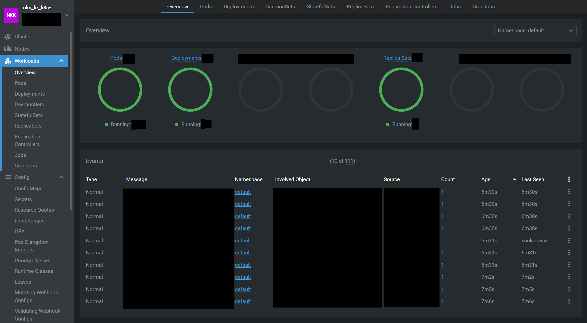  

### 1.2. Naver Cloud Platform(NCP)
 - 안정적인 인프라 유지 위한 아래 제품군 사용
    ~~~
    - VPC
    - Server
    - Kubernetes Service 
    - NAS
    - Cloud DB for PostgreSQL
    - Load Balancer
    - Object Storage
    - Back Up
    - Container Registry
    - Cloud Insight
    ~~~

### 1.3. Amazon Web Service(AWS)
 - Naver Cloud Platform을 대체하기 위해 현재 마이그레이션 중
 - 안정적인 인프라 유지 위한 아래 제품군 사용
    ~~~
    - VPC
    - EC2
    - Elastic Kubernetes Service
    - Elastic Container Registry
    - S3
    - RDS
    ~~~

### 1.4. CI/CD
 - 제품의 최신 이미지 Build 및 Container Registry를 향한 Push, 기타 자동화 위해 사용
  - __인적오류 제거 및 배포 속도 2.3배 상승__(Container Build의 경우)
 - 사내 서버에 Teamcity, NCP Kubernetes에 Argo CD 배포
 - 사내 Git 저장소 연동, 조건에 따른 자동 Build 및 Push 등 파이프라인 구축
 - Artifact 저장 및 사내 FTP 동기화 통한 제품 일관성 유지
 - Terraform 배포 연계 고려중  
 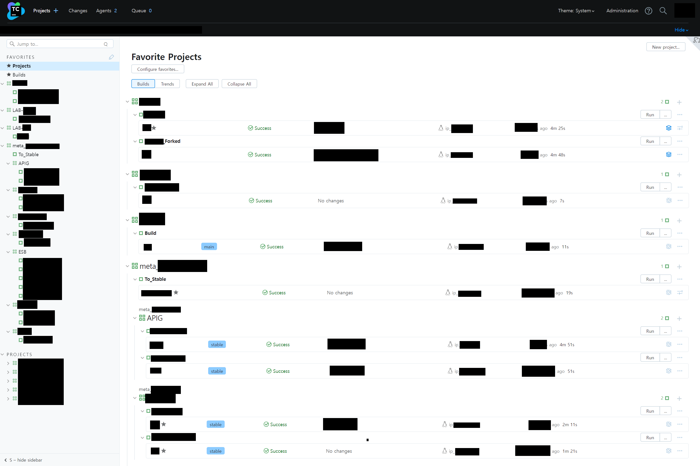  
 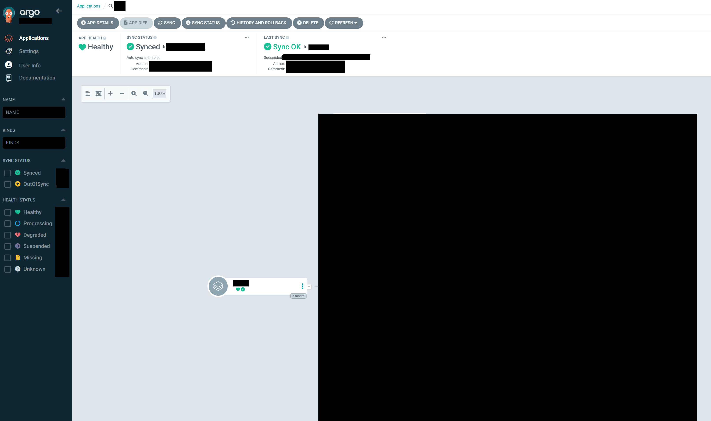  

### 1.5. IaaC
 - __IaaC 필요성에 따라 Terraform 도입__
 - __Ncloud Provider를 통해 90% 이상의 필요 인프라 구현__
 - aws Provider를 통한 인프라 마이그레이션 진행 중
 - 사내 Git 연계 및 메뉴얼 작성됨  
   
 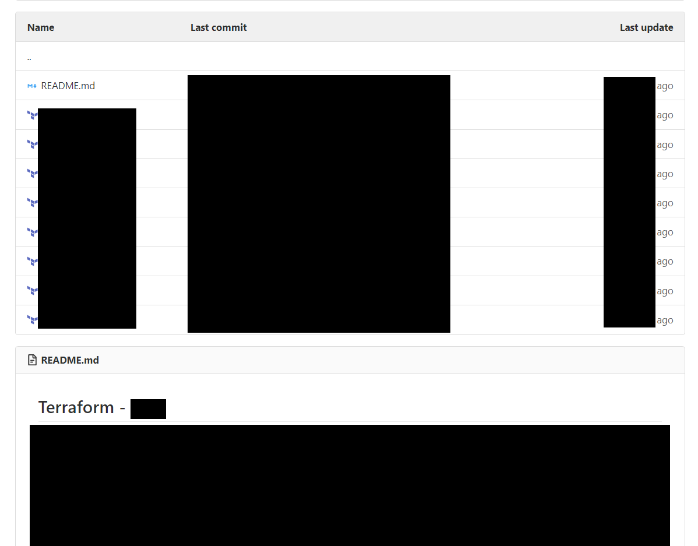  

### 2. 클라우드 서비스 보안 인증(CSAP)
 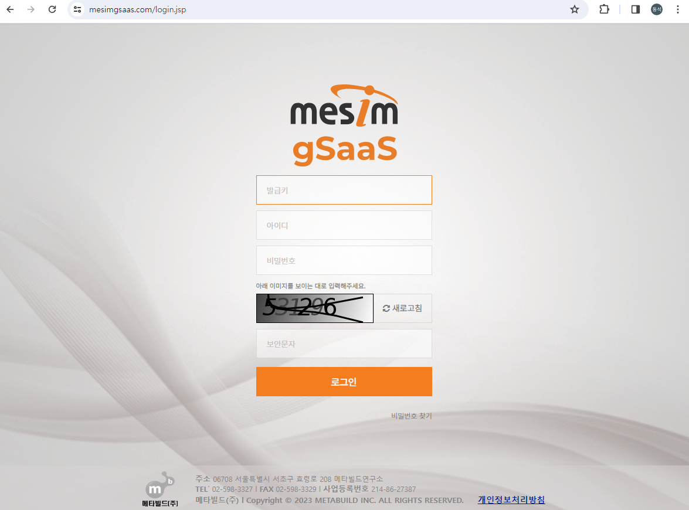
 - 대규모 트래픽이 예상되는 자사 제품(ESB, APIG, Datahub 등)의 SaaS화
 - Linux 상 Python과 Shell 스크립트를 통한 설정 및 자사 제품 설치 자동화
### 2.1. Naver Cloud Platform(NCP)
 - 보안 요구사항 위해 국내 Cloud Provider 채택, 아래 제품군 사용
    ~~~
    - VPC
    - Server
    - NAS
    - Object Storage
    - Certificate Manager
    - Cloud DB for PostgreSQL
    - Load Balancer
    - Global DNS
    - Back Up
    - Cloud Insight
    - SSL VPN
    - Security Monitoring
    - 기타 등등
    ~~~
 - NHN Cloud, KT Cloud, Samsung Cloud Platform 마이그레이션 중

### 2.2. 네트워킹, 보안
 - __Networking 관련 TLS, VPC, Subnet, NAT-G, VPN, Routing Table, ACG, ACL 등의 다양한 보안 요소 적용__
 - 도메인 확보 및 NCP DNS 적용
 - TLS(HTTPS) 인증서 발급(도메인 증명) 및 LoadBalancer, Nginx 등 인증서 적용 통한 HTTPS 활성화
 - CCE, CVE 검사 자동화 연계
 - Mail 인증(도메인 SPF 증명)
 - HTTPS 미사용 대비 기술(Redirect(301), HSTS, 유일 도메인 등) 적용

### 3. 사내 DEVOPS 협업 및 자원 관리
 - Openstack 기반 사내 클라우드 서버 운영
 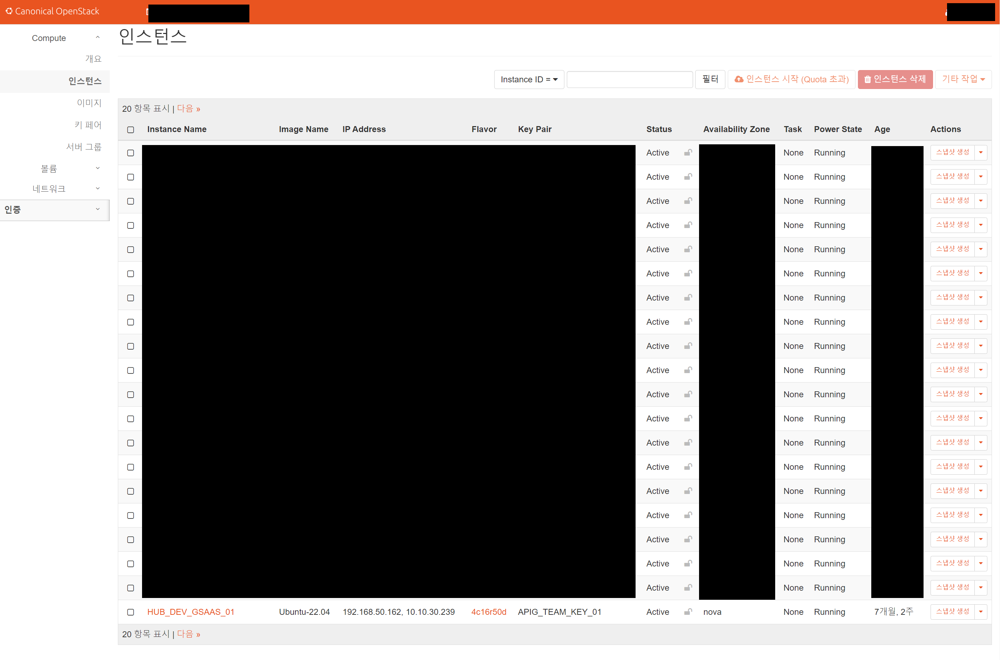
 - 내부 인증서 발급 및 유지보수
 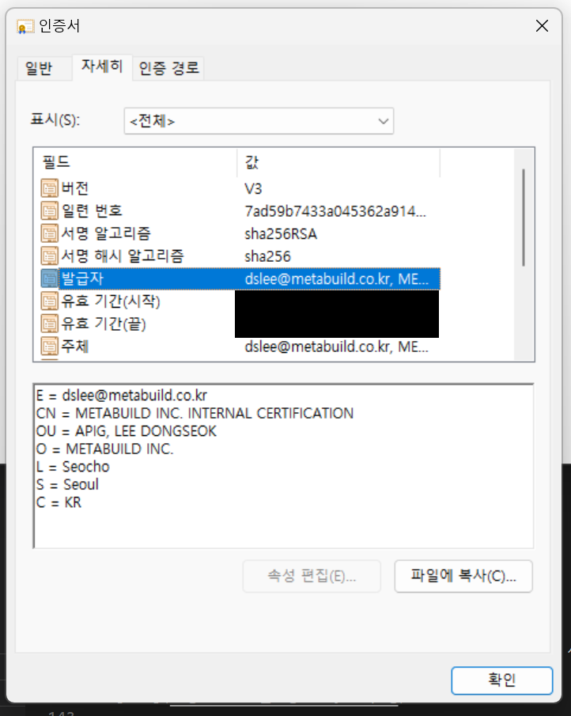
 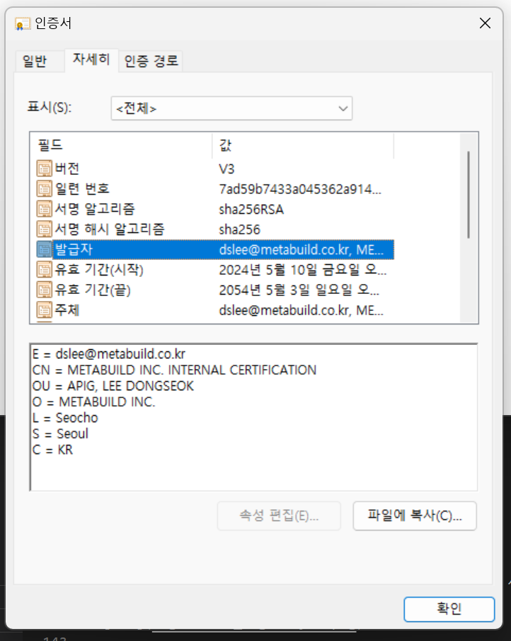
 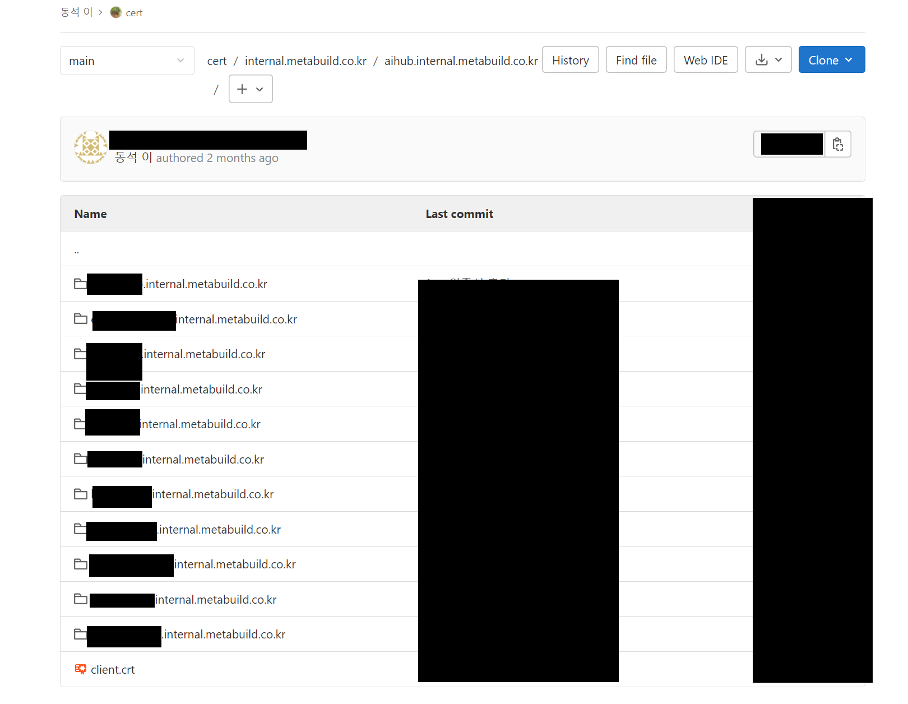
 - DNS 서버 구축 및 운영
 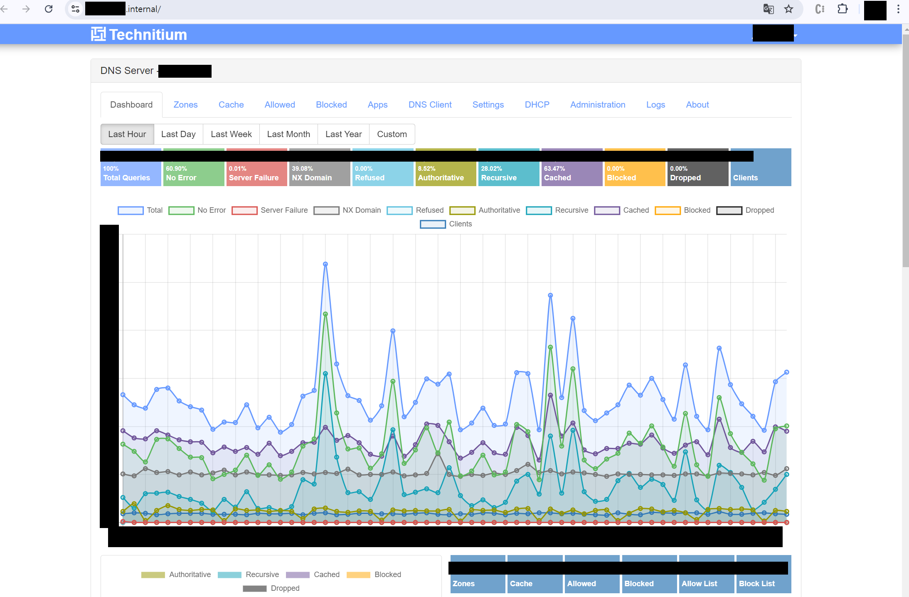
 - Git 정책 등 컨벤션 수립
 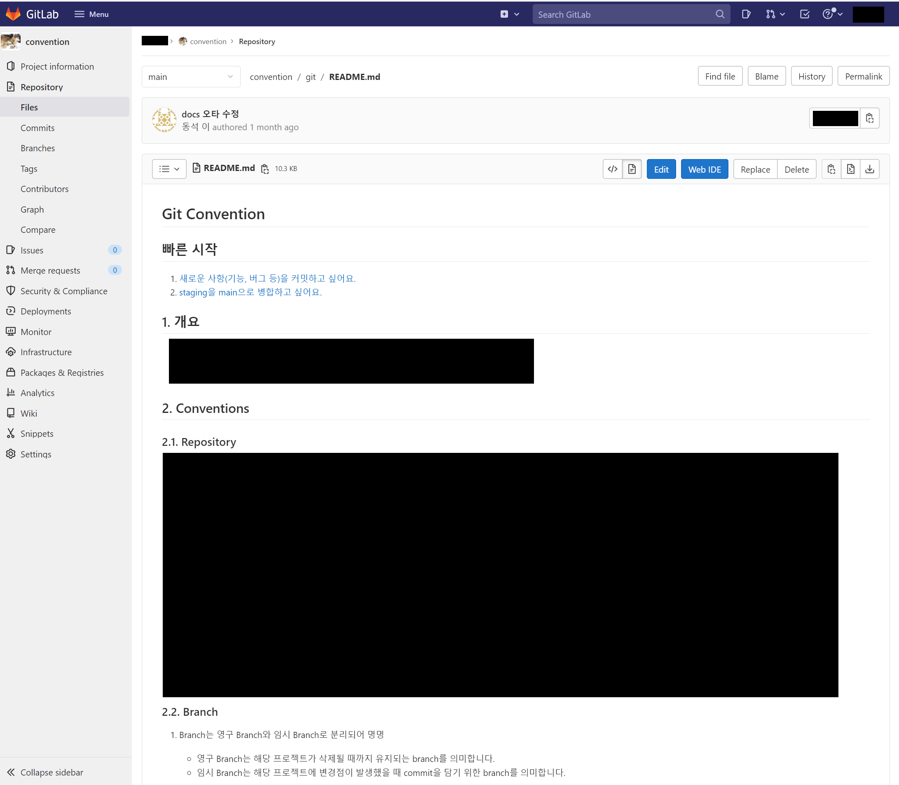

***

## (주)아이와즈
 - 2020.05 ~ 2022.06

### 1. 개발 DEVOPS 도입을 위한 연구 및 실증, 구축, 배포

### 1.1. CI/CD
 - CI/CD 도입을 위해 사내 서버에 Teamcity 배포
 - __배포 및 테스트 속도 2.1배 향상__
 - 인적오류 제거됨
 - 초기에는 Jenkins 사용하였으나 보안상 이유로 전환

### 1.2. Google Cloud Platform(GCP)
 - __CI/CD 연계 및 배포를 위한 연구 및 실증 진행__
 - __기술 테스트, 신입사원 교육 등의 유연한 Linux Server 필요에 대응__

### 1.3. Monitoring 시스템
 - Elastic 社의 Elastic Search, Kibana, Metricbeat, Auditbeat 사용
 - Host(Server) 별 CPU, RAM, Traffic, Docker Image & Container, Access Log, sudo commands 등의 정보 확인 및 보존
 - Docker 기반 구동으로 빠르고 안정적인 설치  
  
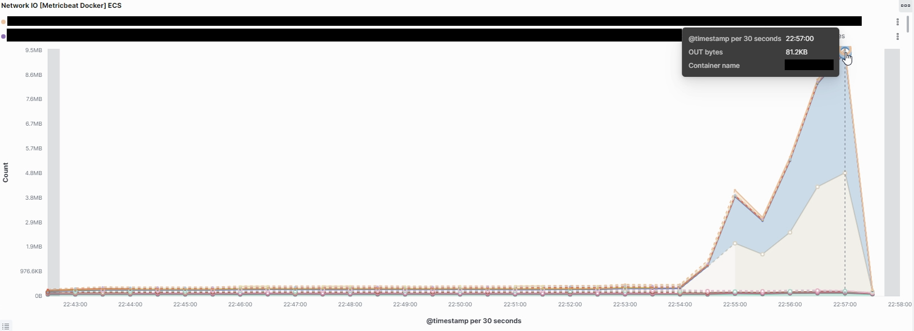  
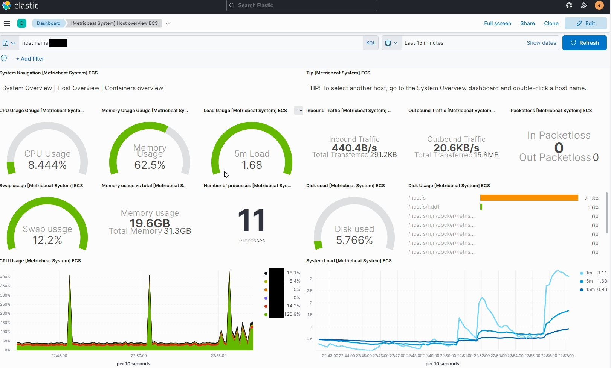  
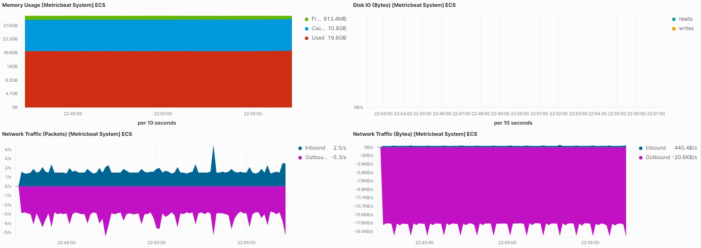  
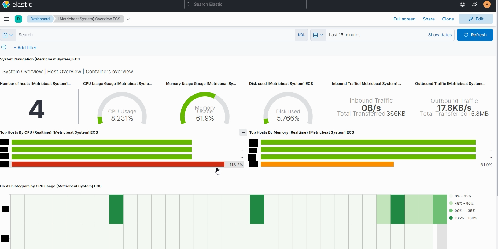  

### 1.4. Private Docker Registry
 - 사내 보안상 Docker Hub를 사용할 수 없는 Image들의 사용을 위해 구축  
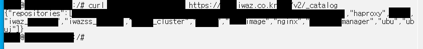  

### 1.5. Private Git Storage(Gitea)
 - 사내 보안상 Public Git 저장소 사용 불가하여 구축
 - CI/CD 연계 사용(Teamcity, Jenkins)  
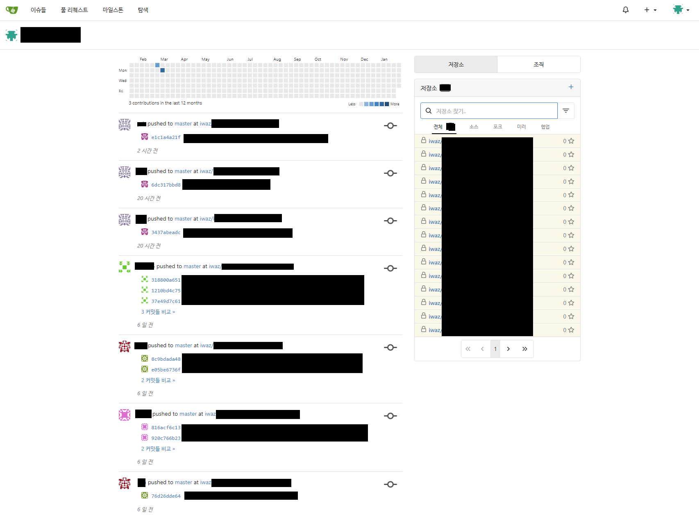  
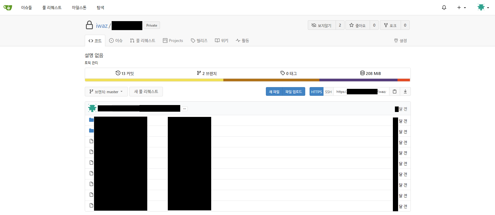  

### 2. 색인 정보 검색 시스템의 서버, 클라이언트 개발 (JAVA, Python)
 - Multiple Threads(Pool), Serialization 기반 TCP 통신
 - Kafka MQ를 통한 Cassandra DB(No SQL), HDFS, Galera(Maria DB), Elastic Search 파이프라인
 - API Server(Flask Framework)
 - 아래의 데이터 보존 환경을 Docker 기반으로 구축

   ~~~
   HDFS (Replicated, Distributed)
   - 바이너리 데이터의 저장
   Cassandra DB (Distributed)
   - 바이너리 데이터의 메타 데이터를 유연하게 저장
   Kafka (MQ)
   - 파이프라인의 유연한 확장 및 축소
   Galera(Maria DB) (Replicated)
   - 일반적인 데이터의 저장
   ~~~

 - ETRI, 경찰대학 납품
***

# 커뮤니케이션
## '클라우드 개요' 전직원 대상 PPT
 - 2023년, (주) 메타빌드
 - 참석자 300명 이상
 - 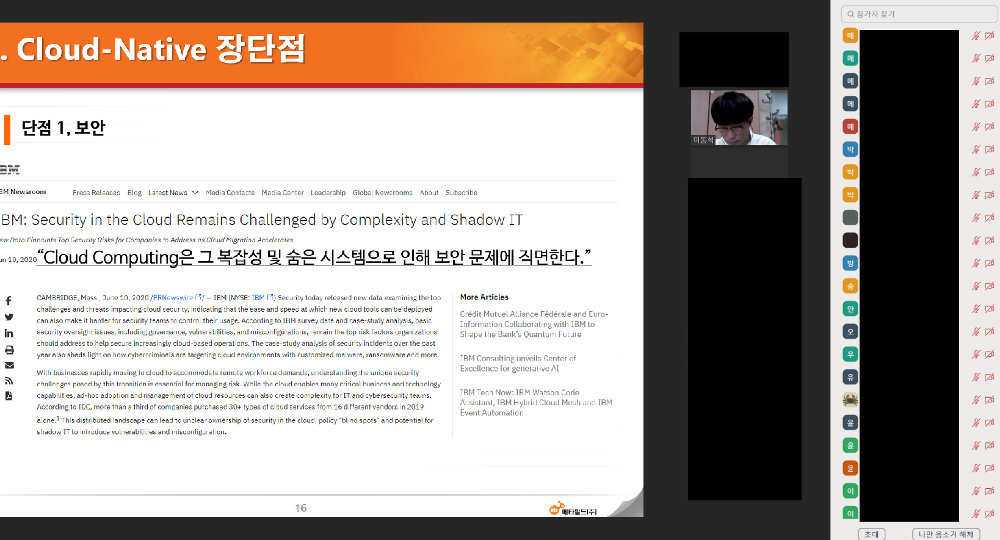
## '연구노력상' 수상
 - 2023년, (주)메타빌드
 - 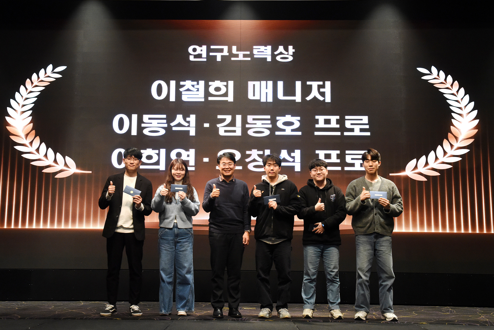
## '같이 일하고 싶은 사원 상' 수상
 - 2021년, (주)아이와즈
 - 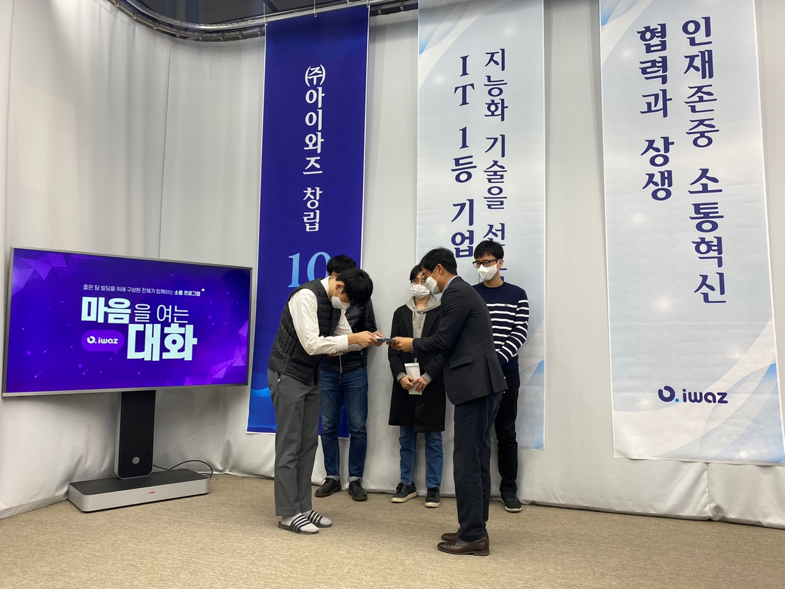
## 채용 홍보영상 출연 및 촬영
 - 2021년, (주)아이와즈
 - 사진을 누르면 이동합니다.
 - 
## 복지 홍보영상 출연
 - 2022년, (주)아이와즈
 - 사진을 누르면 이동합니다.
 - 

# 기타경력
## 게임 Dedicated 서버 대여 서비스
 - 2020.07 ~ 2023.12
 - __GCP(Google Cloud Platform), Discord(게임 커뮤니티 서비스) API 사용, Killing Floor 2(게임)의 Dedicated 서버를 자동 구축하여 일정 시간 동안 대여해주는 서비스__
 - __2023년 10월 9일 기준, 누적 서버 생성 요청 건수 1,983건, 누적 플레이타임 5,949시간__
 - Python, libcloud(Library), discord.py(Library), selenium(Library) 사용
 - 요청에 따른 서버 운영을 통한 __예산 4배 절약__
 - 전체 소스코드 공개 : https://github.com/Acet-Aminophen/KF2_AUTO_SERVER_MAKER
 - 서비스 주소 : https://discord.com/invite/X5hzHwp
 - 아키텍쳐  
 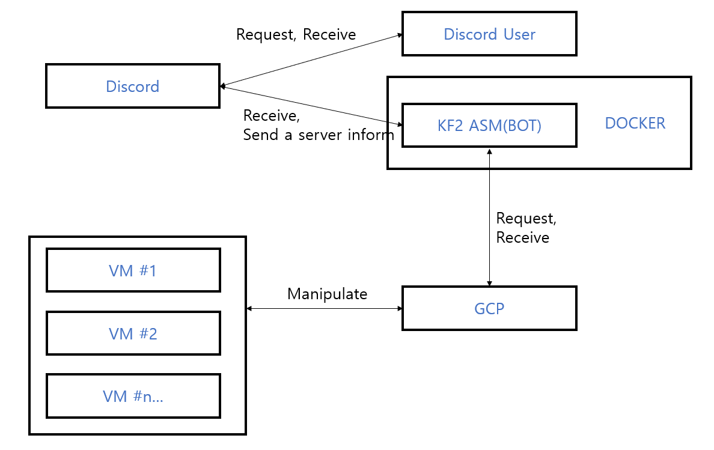  
 - 실제 서비스 이미지  
 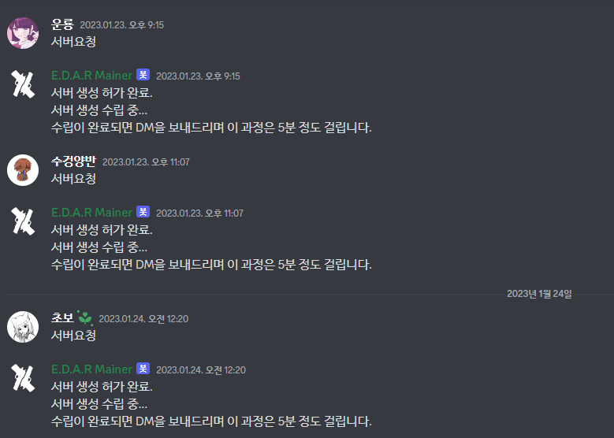  
 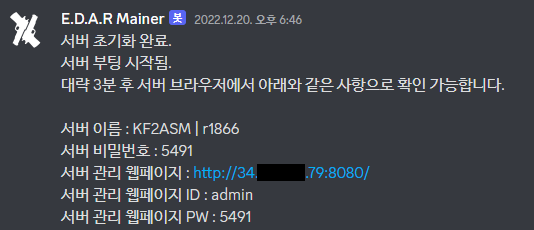  

## Visual Novel 게임 제작 및 팀 운영
 - 2016.02 ~
 - __Visual Novel 게임 제작 팀(1st Studio) 운영 및 게임 출시__
 - __2개 게임 출시__

### 1. 기억이 녹아내리는 거리에서
 - 2018년 출시
 - __리뷰 800+, 다운로드 10,000+__
 - 주소 : https://play.google.com/store/apps/details?id=com.firststudio.memories
 - PINI ENGINE 사용
 - 개발 수행  
  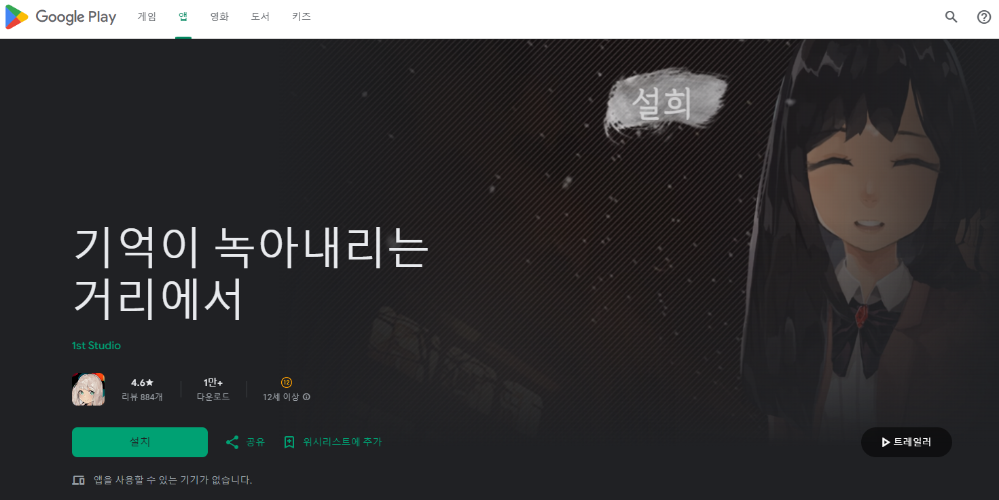  

### 2. 모니터 속의 그녀
 - 2017년 출시
 - __리뷰 50+, 다운로드 1,000+__
 - 주소 : https://play.google.com/store/apps/details?id=com.teamhg.game
 - PINI ENGINE 사용
 - PL, 개발 수행  
 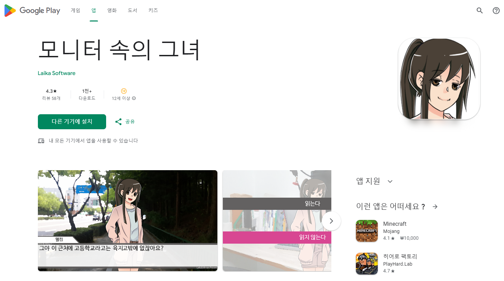  
